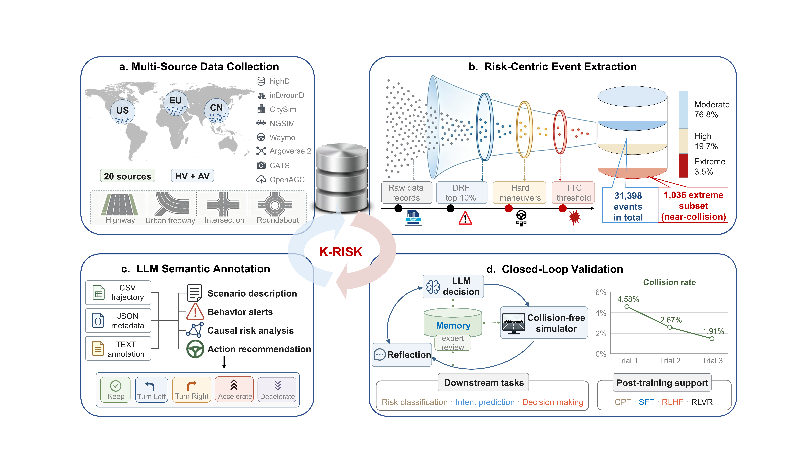
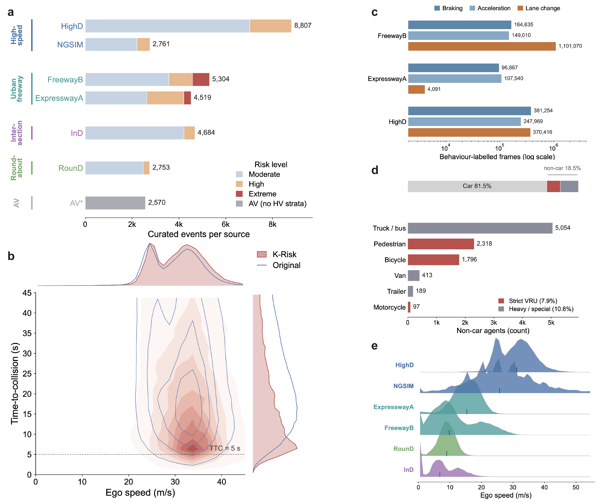

# K-Risk

**A knowledge-augmented dataset of high-risk driving scenarios with LLM annotations for autonomous driving**

[](#)
[](#)
[](#license)

K-Risk pairs **structured vehicle trajectories** with **LLM-generated natural-language annotations** for safety-critical driving. It aggregates **20 naturalistic (HV) and automated-vehicle (AV) trajectory sources** across Europe, China and the United States — covering highways, urban freeways, intersections and roundabouts — and curates **31,398 high-risk events**, including a **1,036-event extreme near-collision subset**.

This repository hosts the **data-processing pipeline** (event extraction, scenario-description generation, the closed-loop LLM annotation driver, and the statistics/figure scripts). The **processed dataset itself is distributed separately on Figshare** (see [Data availability](#data-availability)) and is *not* tracked in this repository.

<p align="center">
  
</p>

---

<!-- ## Table of contents

- [Highlights](#highlights)
- [Dataset at a glance](#dataset-at-a-glance)
- [Source datasets](#source-datasets)
- [Repository structure](#repository-structure)
- [Data layout (Figshare release)](#data-layout-figshare-release)
- [Event schema](#event-schema)
- [Installation](#installation)
- [Usage](#usage)
- [Data availability](#data-availability)
- [Citation](#citation)
- [License](#license)
- [Acknowledgements](#acknowledgements)
- [References](#references)

--- -->

## News

- 🔥 **[2026/06]** Initial release of the **K-Risk data-processing pipeline** (event extraction, scenario-description generators, the closed-loop LLM annotation driver, and the statistics/figure scripts).
- 🗓️ **Coming soon** — the full **K-Risk dataset** (event-level trajectories, annotations and LLM responses) will be released on **Figshare**, together with benchmark splits and an accompanying *Scientific Data* paper.

---

## Highlights

- 🌍 **Multi-region, multi-environment** — 20 HV + AV trajectory sources from Europe, China and the United States, spanning highways, urban freeways, intersections and roundabouts.
- ⚠️ **Multi-dimensional risk definition** — events are screened by a *driver risk field (DRF)* filter, *calibrated hard-maneuver thresholds* (hard acceleration / braking, lane change), and a *two-second trajectory-conflict predictor*, then graded **moderate / high / extreme**.
- 🧩 **Synchronized triple per event** — every event is stored as a **CSV** (trajectories), a **JSON** (symbolic metadata), and a **TXT** (natural-language annotation) that share one event identifier.
- 🤖 **Closed-loop LLM annotation** — a representative subset receives an LLM causal-risk analysis and a discrete action recommendation from a **five-action schema**, validated against a collision-free simulator with iterative reflection.
- 🔁 **Reusable across post-training stages** — the release supports CPT, SFT, RLHF (preference pairs) and RLVR (verifiable simulator reward) for driving agents.

---

## Dataset at a glance

| | |
|---|---|
| Trajectory sources | **20** (6 human-driven + 14 automated-vehicle) |
| Regions | Europe, China, United States |
| Environments | Highway, urban freeway, intersection, roundabout |
| Curated high-risk events | **31,398** |
| Extreme near-collision subset | **1,036** events |
| Risk levels (HV) | Moderate 76.8% · High 19.7% · Extreme 3.5% |
| Unique agents | 53,295 (18.5% non-car: VRUs + heavy/special vehicles) |
| LLM-annotated subset | 372 events (responses from GPT-4o and GPT-4.1) |
| Per-event representation | CSV + JSON + TXT (synchronized triple) |
| Action schema | IDLE · Turn Left · Turn Right · Acceleration · Deceleration |

<p align="center">
  
</p>

---

## Source datasets

K-Risk is a **secondary dataset**: it releases only the **event-level segments** derived from the sources below. The complete original recordings are **not** redistributed and remain available from their providers under their own licenses. Each source was used in accordance with its license and terms of use.

### Human-driven vehicles (HV)

| Source | Collection | Region | Environment | Link |
|---|---|---|---|---|
| highD | LevelXData | Germany | Highway | https://www.highd-dataset.com |
| inD | LevelXData | Germany | Intersection | https://www.ind-dataset.com |
| rounD | LevelXData | Germany | Roundabout | https://www.round-dataset.com |
| ExpresswayA | CitySim | China | Urban freeway | https://github.com/UCF-SST-Lab/UCF-SST-CitySim1-Dataset |
| FreewayB | CitySim | China | Urban freeway | https://github.com/UCF-SST-Lab/UCF-SST-CitySim1-Dataset |
| NGSIM (I-80) | FHWA NGSIM | United States | Highway | https://ops.fhwa.dot.gov/trafficanalysistools/ngsim.htm |

### Automated vehicles (AV)

The 14 AV sources follow the unified longitudinal trajectory collection of **Ultra-AV** [[1]](#references); the CATS, Central Ohio and Vanderbilt recordings are obtained through Ultra-AV, which documents their original providers and access points.

| Source | Provider | Region | Link |
|---|---|---|---|
| Argoverse 2 Motion Forecasting | Argo AI | United States | https://www.argoverse.org/av2.html |
| Waymo Open Motion | Waymo | United States | https://waymo.com/open/ |
| Waymo Open Perception | Waymo | United States | https://waymo.com/open/ |
| MicroSimACC | microSIM-ACC | United States | https://github.com/microSIM-ACC/ICE |
| OpenACC — Casale | JRC (EU) | Europe | https://data.jrc.ec.europa.eu/dataset/9702c950-c80f-4d2f-982f-44d06ea0009f |
| OpenACC — Vicolungo | JRC (EU) | Europe | https://data.jrc.ec.europa.eu/dataset/9702c950-c80f-4d2f-982f-44d06ea0009f |
| OpenACC — AstaZero | JRC (EU) | Europe | https://data.jrc.ec.europa.eu/dataset/9702c950-c80f-4d2f-982f-44d06ea0009f |
| OpenACC — ZalaZONE | JRC (EU) | Europe | https://data.jrc.ec.europa.eu/dataset/9702c950-c80f-4d2f-982f-44d06ea0009f |
| CATS — ACC | Ultra-AV | United States | https://github.com/CATS-Lab/Filed-Experiment-Data-ULTra-AV |
| CATS — Platoon | Ultra-AV | United States | https://github.com/CATS-Lab/Filed-Experiment-Data-ULTra-AV |
| CATS — UWM | Ultra-AV | United States | https://github.com/CATS-Lab/Filed-Experiment-Data-ULTra-AV |
| Central Ohio — single-vehicle | Ultra-AV | United States | https://github.com/CATS-Lab/Filed-Experiment-Data-ULTra-AV |
| Central Ohio — two-vehicle | Ultra-AV | United States | https://github.com/CATS-Lab/Filed-Experiment-Data-ULTra-AV |
| Vanderbilt ACC | Ultra-AV | United States | https://github.com/CATS-Lab/Filed-Experiment-Data-ULTra-AV |

---

## Repository structure

This repository contains the pipeline code only. Scripts read from a local copy of the dataset (downloaded from Figshare) and write the per-event records, statistics and figures.

```
K-Risk/
├── generate_highd.py          # HighD scenario-description generator (+ highd_msg system prompt)
├── generate_expresswayA.py    # CitySim ExpresswayA generator (+ expresswayA_msg)
├── generate_freewayB.py       # CitySim FreewayB generator (+ freewayB_msg)
├── generate_ind.py            # inD (intersection) generator (+ ind_msg)
├── generate_round.py          # rounD (roundabout) generator (+ round_msg)
├── generate_ngsim.py          # NGSIM I-80 generator (+ ngsim_msg)
├── generate_AV.py             # AV (longitudinal / car-following) generator (+ AV_msg)
├── prompts.py                 # Shared system prompt + the five-action decision schema
├── llm_test.ipynb             # Driver notebook: build samples, query the LLM, store responses
├── compute_statistics.py      # Per-source / risk-level statistics and distribution CSVs
└── plot_overview.py           # Combined composition / statistics overview figure (PNG + PDF)
```

Each `generate_<source>.py` exports `generate_<source>(json_path, frame_step=...)`, returning a multi-frame English scenario description, plus a `<source>_msg` system prompt that frames the LLM as a driving assistant. The generators embed **source-specific lane topology** and **risk-reminder templates**, so they are **not interchangeable** — pick the one matching the source of the JSON. Both list-of-records and nested-frames (`{"frames": [...]}`) JSON shapes are supported.

---

## Data layout (Figshare release)

The dataset is organized into three top-level directories. Within `trajectory_data/` and `event_annotations/`, events are split into human-driven (`HV/`) and automated-driving (`AV/`) groups, then one folder per source. Each per-event triple shares the event identifier encoded in its file name, so the CSV, JSON and TXT records of one event can be matched across directories.

```
K-Risk_data/
├── trajectory_data/                 # Per-event trajectory segments underlying each event
│   ├── HV/<source>/...
│   └── AV/<source>/...
├── event_annotations/               # Extracted per-event records (JSON)
│   ├── HV/
│   │   ├── highd/  {highd_high_risk/, highd_normal_risk/, info.txt}
│   │   ├── ind/    rounD/  ngsim/  expresswayA/  freewayB/
│   │   └── extreme/  {ttc_1s/, ttc_2s/, info.txt}   # cross-source near-collision subset
│   └── AV/<source>/{acc/, brake/, ttc/}             # split by risk-event criterion
└── llm_analysis/                    # Natural-language layer for the LLM-annotated subset
    ├── event_discriptions/          # Structured scenario descriptions fed to the LLM
    ├── analysis_gpt4o/              # GPT-4o decision responses
    └── analysis_gpt4.1/             # GPT-4.1 decision responses
```

- **HV** sources are split into `*_high_risk` / `*_normal_risk` folders; near-collision cases are collected in a separate `extreme/` folder (`ttc_1s` / `ttc_2s`).
- **AV** sources each contain `acc/`, `brake/` and `ttc/` folders, named by the triggering risk-event criterion.
- Per-folder `info.txt` files document the column semantics for that group.

> **Event identifier conventions.** highD uses `highd_<track>_<egoId>_<relation>_<behavior>_frame_<start>_to_<end>.json` (e.g. `highd_01_113_precedingId_yaw_right_frame_2205_to_2312`); other sources use `<source>_track_<n>_car_<id>_frame_<start>_to_<end>.json`; AV uses `trajectory_<id>_lv_<leadId>_<n>.json`.

---

## Event schema

Each event is a synchronized **CSV + JSON + TXT** triple. Because every event keeps the **native column names of its source**, per-frame fields are described by role; a field absent in a source is simply not present in its files.

**Event-level descriptors** (from the file name / folder): `event_id`, `source_dataset`, `ego_id`, `risk_level` (normal/high/extreme), `frame_start`, `frame_end`, and for highD additionally `relation` (preceding / following / left-right-preceding / following / alongside) and `behavior` (`acc_high`, `brake_high`, `yaw_left`, `yaw_right`).

**Per-frame trajectory fields** (role → column names across sources):

| Role | Column name(s) across sources | Unit |
|---|---|---|
| frame index | `frame` · `frame_id` · `Frame_ID` | — |
| agent id | `id` · `car_id` · `trackId` · `Vehicle_ID` | — |
| position | `x,y` · `car_center_x,y` · `xCenter,yCenter` · `Local_X,Y` | m |
| size | `width,height` · `length` · `v_Length,v_Width` | m |
| speed | `speed` · `v_Vel` | m/s |
| velocity components | `xVelocity,yVelocity` · `vx,vy` · `lonVelocity,latVelocity` | m/s |
| acceleration | `xAcceleration,yAcceleration` · `acceleration` · `lon/latAcceleration` · `v_Acc` | m/s² |
| heading | `heading` · `course` | deg |
| yaw rate | `yaw_rate` (CitySim) | deg/s |
| lane | `laneId` · `lane_id` · `Lane_ID` | — |
| agent class | `vehicle_class` · `class` · `v_Class` | — |
| spacing | `dhw,thw` · `Space_Headway,Time_Headway` | m, s |
| time-to-collision | `ttc` · `TTC` · `TTC_0_1s,TTC_1_2s` | s |
| trajectory conflict | `collision_0_1s,collision_1_2s,collision_ids_*` (CitySim) | — |
| risk value | `total_risk` · `risk_value` (DRF) | — |
| surrounding agents | `precedingId,followingId,...` · `preceding_id,following_id,...` | — |
| behavioral flags | `acc_high,brake_high,yaw_left,yaw_right` · `acc/brake/left_turn/right_turn_label` | bool |

> The AV (Ultra-AV-derived) sources use a shared longitudinal schema instead: `Trajectory_ID`, `Time_Index`, `ID_LV`, `Type_LV`, `Pos_LV`, `Speed_LV`, `Acc_LV`, `ID_FAV`, `Pos_FAV`, `Speed_FAV`, `Acc_FAV`, `Space_Gap`, `Space_Headway`, `Speed_Diff`, `TTC`.

**Natural-language annotation (TXT)** components: a structured **scenario description**, rule-based **risk reminders**, an LLM **risk analysis** (representative subset), and a discrete **`action_id`** from the five-action schema (1 IDLE, 2 Turn Left, 3 Turn Right, 4 Acceleration, 5 Deceleration).

---

## Installation

The pipeline targets **Python 3.9+** and the standard scientific stack, plus a LangChain LLM client for the annotation step.

```bash
git clone https://github.com/benmagnifico/K-Risk.git
cd K-Risk

python -m venv .venv && source .venv/bin/activate   # optional
pip install pandas numpy matplotlib jupyter
pip install langchain langchain-openai openai tenacity   # only for the LLM annotation step
```

Set your API key before running the LLM annotation:

```bash
export OPENAI_API_KEY="sk-..."
```

> **Note.** The dataset is downloaded separately from Figshare (see [Data availability](#data-availability)). Point the scripts at your local copy of `K-Risk_data/` before running them.

---

## Usage

### 1. Generate a natural-language scenario description

```python
from generate_highd import generate_highd, highd_msg

text = generate_highd(
    "K-Risk_data/event_annotations/HV/highd/highd_high_risk/"
    "highd_01_113_precedingId_yaw_right_frame_2205_to_2312.json",
    frame_step=5,
)
print(text)   # multi-frame English description; pair with `highd_msg` as the system prompt
```

Use the generator matching the source: `generate_expresswayA` / `generate_freewayB` (CitySim), `generate_ind`, `generate_round`, `generate_ngsim`, or `generate_AV` (longitudinal AV). The `extreme/` subset inherits the CitySim schema, so it is described with `generate_expresswayA` / `generate_freewayB`.

### 2. Query the LLM (closed-loop annotation)

Open `llm_test.ipynb`. It provides:

- `create_samples(scenario, frame_step, num_examples, risk_level)` — samples event JSONs and writes scenario descriptions.
- `llm_response(input_file, system_message, llm, output_folder)` — sends a description plus its system prompt to the LLM and stores the response.

> ⚠️ **Paths in the notebook are hard-coded Windows paths** from the original authoring machine. Update the `base_folder` / `output_dir` (and the API key) to your local `K-Risk_data/` paths before running.

### 3. Recompute statistics and figures

```bash
python compute_statistics.py    # writes K-Risk_statistics.md + distribution CSVs
python plot_overview.py         # writes the combined overview figure (PNG + PDF)
```

Both scripts resolve paths relative to their own location and expect `event_annotations/` and `trajectory_data/` alongside them (or adjust the `HERE`/path constants at the top).

---

## Data availability

The K-Risk dataset is archived on **Figshare** (DOI to be assigned on acceptance) and is **not** stored in this Git repository:

- **Code & pipeline:** `https://github.com/benmagnifico/K-Risk`
- **Dataset (archived):** `Coming Soon.`

The release contains the event-level trajectory segments, the risk annotations and metadata, and the natural-language descriptions and LLM responses, organized into `trajectory_data/`, `event_annotations/` and `llm_analysis/`. The original recordings are available from the providers listed in [Source datasets](#source-datasets).

---

## Citation

```bibtex
Coming Soon.
```

Please also cite the original source datasets you use (see [Source datasets](#source-datasets)), in particular Ultra-AV for the AV component.

---

## License

The pipeline code and the processed K-Risk records are released **for research use**. The original source recordings remain under the licenses and terms of their respective providers; obtain and use them accordingly.

---

## Acknowledgements

This research was conducted by KAIST as part of a joint research project under the Korea Institute of Science and Technology Information (KISTI) R&D program, *"Development of the Next-Generation Integrated Wired/Wireless Communication Gateway (X-Gateway)."* We thank the providers of all 20 source datasets for making their recordings publicly available.

<!-- ---

## References

[1] Z. Zhou et al., "A unified longitudinal trajectory dataset for automated vehicle," *Scientific Data*, 2024. Ultra-AV: https://github.com/CATS-Lab/Filed-Experiment-Data-ULTra-AV -->
